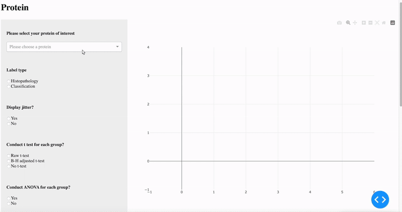

#  Thyroid Proteomics Dashboard

这是一个基于 Dash 的交互式网页应用，旨在展示甲状腺不同组织病理类型中的蛋白表达数据，并提供多种可视化和统计分析功能。

## 🟢 项目简介

该项目通过选择组织病理分类（如正常组织、甲状腺腺瘤、甲状腺癌等）以及具体蛋白名称，展示以下内容：

- 📊 **蛋白表达箱形图（Boxplot）**：显示所选蛋白在不同组织病理中的分布。
- 📈 **蛋白表达排名图（Rank Plot）**：展示蛋白在总体数据中的表达排名。
- 📊 **不同组织病理的排名图对比**：比较不同组织中的表达排名变化。
- 📊 **统计学分析**：支持执行 t-test、ANOVA 等差异分析并展示显著性水平。

## 🟢 项目演示

## 🔸 备注

本项目基于一个真实的医学蛋白组学数据开发，原始数据目前暂时未公开。